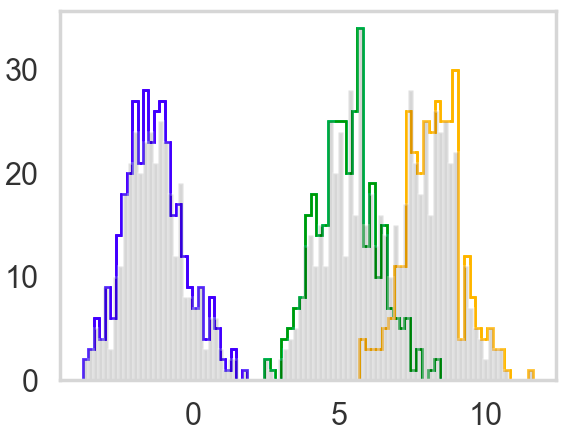

[](http://quantlet.de/)

## [](http://quantlet.de/) **GMMvb** [](http://quantlet.de/)

```yaml

Name of Quantlet: GMMvb

Published in: 'Metis Variational Bayes'

Description: 'Use Variational Bayes (VB) to approximate the density of Gaussian Mixture Modes (GMM)'

Keywords: 'Variational Bayes, Gaussian Mixture Modes, Approximation, Conditional density, Posterior'

Author: Rui Ren

See also: 'Variational Inference https://zhiyzuo.github.io/VI/'

Submitted: 'Wed, Nov 21 2018 by Rui Ren'

```




### PYTHON Code
```python

import numpy as np
import scipy as sp
import matplotlib as mpl
import matplotlib.cm as cm
import matplotlib.pyplot as plt
import pandas as pd
pd.set_option('display.width', 500)
pd.set_option('display.max_columns', 100)
pd.set_option('display.notebook_repr_html', True)
import seaborn as sns
sns.set_style("whitegrid")
sns.set_context("poster")
#import pymc3 as pm
import math
from scipy.stats import multivariate_normal as mv

# hyperparameters
prior_std = 8

# True parameter
K = 3
mu = []
for i in range(K):
    mu.append(np.random.normal(0, prior_std))
print(mu)
var = 1
var_arr = [1, 1, 1]


# Plot variables
color = ['blue', 'green', 'orange', 'yellow', 'red']

n = 1000
# Simulated data
mixture_selection_matrix = np.identity(K) 
N = np.random.choice(K, n)

from collections import defaultdict
data = []
data_resp=defaultdict(list)
plt.figure(1)
for i in range(n):
    # pick category
    mean = np.dot(mixture_selection_matrix[N[i]], mu) 
    cov = np.dot(mixture_selection_matrix[N[i]], var_arr)*var
    # get point from distribution
    x = np.random.normal(mean, cov)
    data.append(x)
    data_resp[N[i]].append(x) 


#figure
for k in range(K):
    plt.hist(data_resp[k], bins=30, color=color[k], histtype='step', lw=2)
plt.hist(data, color='k', bins=90, alpha=0.2) #, alpha=0.2 colors transparency
plt.grid(False)
plt.show()


# Variational Inference - CAVI

def VI(K, prior_std, n, data):
    # Initialization
    mu_mean = []
    mu_var = []
    for i in range(K):
        mu_mean.append(np.random.normal(0, prior_std))
        mu_var.append(abs(np.random.normal(0, prior_std)))

    c_est = np.zeros((n, K))  # 1000*3 matrix
    for i in range(n):
        c_est[i, np.random.choice(K)] = 1 

    # Initiate CAVI iterations
    while (True):
        mu_mean_old = mu_mean[:]

        # mixture model parameter update step
        for j in range(K):
            nr = 0
            dr = 0
            for i in range(n):
                nr += c_est[i, j] * data[i]
                dr += c_est[i, j]
            mu_mean[j] = nr / ((1 / prior_std ** 2) + dr)
            mu_var[j] = 1.0 / ((1 / prior_std ** 2) + dr)

        # categorical vector update step
        for i in range(n):
            cat_vec = []
            for j in range(K):
                cat_vec.append(math.exp(mu_mean[j] * data[i] - (mu_var[j] + mu_mean[j] ** 2) / 2))
            for k in range(K):
                c_est[i, k] = cat_vec[k] / np.sum(np.array(cat_vec))

        # compute ELBO or check for convergence of variational factors - here we do the latter
        if np.dot(np.array(mu_mean_old) - np.array(mu_mean), np.array(mu_mean_old) - np.array(mu_mean)) < 0.000001:
            break

    # sort the values since the k mixture components dont maintain any ordering across multiple initializations
    mixture_components = list(zip(mu_mean, mu_var))
    mixture_components.sort()
    return mixture_components, c_est

# Run the CAVI algorithm
mixture_components, c_est = VI(K, prior_std, n, data)

print(K,"||",mixture_components, "||", c_est)
for k in range(K):
    plt.hist(data_resp[k], bins=30, color=color[k], alpha=0.3, density=True)
for k in range(K):
    vals=np.random.normal(mixture_components[k][0], 1, size=1000)
    sns.kdeplot(vals,  color='k', linewidth=1.6);
plt.grid(False)
plt.show()


```

automatically created on 2018-11-22